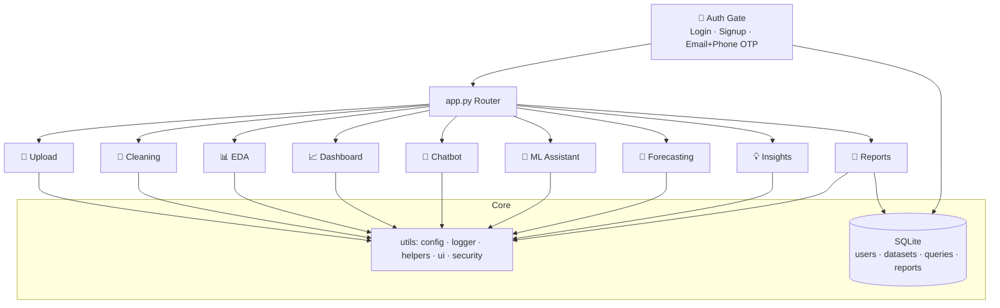

<!-- ═══════════════════════ HEADER ════════════════════════ -->
<a name="top"></a>


<p align="center">
  
</p>

<p align="center">
  <a href="#"></a>
</p>

<!-- ════════════════════════ BADGES ════════════════════════ -->
<p align="center">
  
  
  
  
  
</p>

<p align="center">
  
  
  
  
  
</p>

<p align="center">
  <b>
  <a href="#-overview">Overview</a> •
  <a href="#-features">Features</a> •
  <a href="#-demo">Demo</a> •
  <a href="#-quickstart">Quickstart</a> •
  <a href="#-architecture">Architecture</a> •
  <a href="#-deploy">Deploy</a>
  </b>
</p>

---

## 🌌 Overview

> **InsightAI** is a production-grade, end-to-end analytics platform that behaves like a **virtual data analyst**.
> Upload a CSV/Excel file and instantly get **cleaning, profiling, EDA, executive dashboards, natural-language Q&A, machine-learning predictions, forecasting and automated PDF/Excel reports** — wrapped in a cinematic, animated, fully responsive UI with secure **account login + email & phone OTP verification**.

<p align="center">
  
</p>

---

## ✨ Features

<table>
<tr>
<td width="50%" valign="top">

### 🧠 Intelligence
- 🤖 **Natural-language chatbot** — ask *"top 10 customers"*, *"sales trend"*, *"find anomalies"*
- 🧠 **AutoML** — auto classification/regression with **cross-validation, Accuracy, Precision, Recall, F1, ROC-AUC, R², MAE, RMSE**
- 🔮 **Forecasting** — ARIMA + optional Prophet with confidence bands
- 💡 **Insight engine** — board-ready recommendations in plain business English

</td>
<td width="50%" valign="top">

### 🎨 Experience
- 🌠 **Cinematic 3D hero** (Three.js data-constellation with a gold "route" pulse)
- 💎 **Liquid-glass dark UI** — aurora background, neon accents, 3D hover
- 🔐 **Secure auth** — signup/login/logout + **email OTP & phone OTP** verification
- 📱 **Fully responsive** — desktop, iPad and phone with reduced-motion support

</td>
</tr>
</table>

### 🧩 The 9 modules

| # | Module | What it does |
|---|--------|--------------|
| 1 | 📂 **Data Upload** | CSV/XLSX drag-and-drop, preview, shape & schema |
| 2 | 🧹 **Cleaning** | Missing values, duplicates, outliers (IQR), before/after diff |
| 3 | 📊 **Automated EDA** | Summary stats, correlation, histograms, box, scatter, pairplot |
| 4 | 📈 **BI Dashboard** | Auto KPIs, trends, category & regional analysis, heatmaps |
| 5 | 🤖 **AI Chatbot** | Plain-English Q&A → insights, tables & charts |
| 6 | 🧠 **ML Assistant** | Auto model selection, leaderboard, full metrics, gauge |
| 7 | 🔮 **Forecasting** | ARIMA / Prophet future projections |
| 8 | 💡 **Insights** | Automated business recommendations |
| 9 | 📄 **Reports** | One-click PDF report + multi-sheet Excel summary |

---

## 🎬 Demo

> 📸 _Add screen recordings / GIFs here — they make the repo pop._

<p align="center">
  
</p>

| 🏠 Animated Home | 📈 BI Dashboard |
|:---:|:---:|
| _`docs/home.gif`_ | _`docs/dashboard.png`_ |
| 🤖 AI Chatbot | 🧠 ML Metrics |
| _`docs/chatbot.png`_ | _`docs/ml.png`_ |

---

## ⚡ Quickstart

```bash
# 1) Create a Python 3.12 environment (3.13/3.14 may lack prebuilt wheels)
conda create -n insightai python=3.12 -y
conda activate insightai

# 2) Install
pip install -r requirements.txt

# 3) Generate realistic sample datasets (Sales · Customers · E-commerce)
python data/generate_samples.py

# 4) Launch  (use python -m so Streamlit binds to THIS env)
python -m streamlit run app.py
```

Open **http://localhost:8501** → sign up (or **Continue as guest**) → upload data → explore. 🎉

> 💡 **OTP works out of the box** in *demo mode* (the code is shown on screen).
> For real delivery set `SMTP_*` (email) and `TWILIO_*` (SMS) environment variables — no code changes needed.

<details>
<summary>🔑 Optional environment variables</summary>

| Variable | Purpose |
|----------|---------|
| `OPENAI_API_KEY` / `GEMINI_API_KEY` | Free-form LLM chatbot answers |
| `SMTP_HOST` `SMTP_USER` `SMTP_PASS` `SMTP_PORT` `SMTP_FROM` | Real email OTP delivery |
| `TWILIO_ACCOUNT_SID` `TWILIO_AUTH_TOKEN` `TWILIO_FROM` | Real SMS OTP delivery |

</details>

---

## 🏗️ Architecture



**Layered & modular:** presentation (`utils/ui.py` + `assets/style.css`) · feature modules (`modules/*.py`, each a `render()`) · domain helpers (`utils/helpers.py`) · security (`utils/security.py`) · persistence (`database/db.py`) · cross-cutting logging & config.

```
InsightAI/
├── app.py                 # entrypoint · auth gate · router
├── modules/               # 9 feature modules + auth.py
├── utils/                 # config · logger · helpers · ui · security
├── database/db.py         # SQLite (users, audit trail)
├── data/generate_samples.py
├── assets/style.css       # liquid-glass dark theme
├── .streamlit/config.toml · runtime.txt · requirements.txt
└── .vscode/               # F5 run + tasks
```

---

## 🚀 Deploy

<p align="center"><b>Get a public URL anyone in the world can open — free.</b></p>

1. Push this folder to a **public GitHub repo**.
2. Open **[share.streamlit.io](https://share.streamlit.io)** → **New app**.
3. Pick the repo / branch / `app.py` → **Deploy**.
4. (Optional) add `OPENAI_API_KEY`, `SMTP_*`, `TWILIO_*` under **Secrets**.

`runtime.txt` pins Python 3.12 so the cloud build never fails on wheels.

---

## 🧪 Machine-Learning Rigor

InsightAI doesn't just fit a model — it reports it like a scientist:

<p align="center">
  
  
  
  
  
  
  
</p>

Confusion matrix, ROC curve, per-class report, feature importance and a live metric gauge — all auto-generated.

---

## 📝 Resume Description

> **InsightAI — AI Powered Data Analyst Assistant** *(Python, Streamlit, Pandas, Scikit-Learn, Plotly, SQLite)*
> Architected a production-grade analytics platform automating the full data lifecycle — ingestion, cleaning, EDA, BI dashboards, natural-language querying, cross-validated ML (classification & regression with ROC-AUC/F1), forecasting and automated PDF/Excel reporting. Built a secure auth layer (PBKDF2 hashing, email + phone OTP verification), a cinematic 3D animated responsive UI, layered modular architecture, centralised logging/config and SQLite persistence.

## 🎓 Skills Demonstrated

`Data Engineering` · `Data Cleaning` · `Statistics` · `EDA` · `Data Viz` · `Machine Learning` · `Model Evaluation` · `Time-Series` · `NLP/LLM Integration` · `Authentication & Security` · `Software Architecture` · `UI/UX` · `Responsive Design` · `Reporting`

---

## 🔮 Roadmap

- [ ] SHAP explainability & AutoML hyper-parameter tuning
- [ ] Database/warehouse connectors (Postgres, BigQuery, Snowflake)
- [ ] Agentic LLM analyst that writes & runs its own analysis code
- [ ] Scheduled email report delivery
- [ ] Multi-language insights

---

<p align="center">
  
</p>

<p align="center">
  <sub>Built with ❤️ using Streamlit · Pandas · Plotly · Scikit-Learn &nbsp;•&nbsp; <a href="#top">⬆ back to top</a></sub>
</p>
